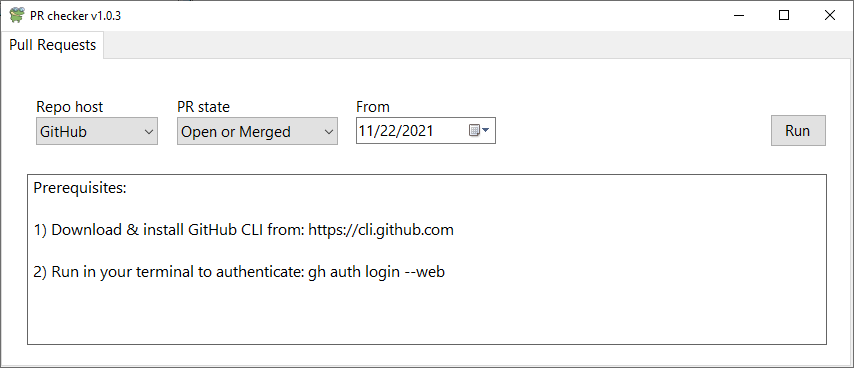
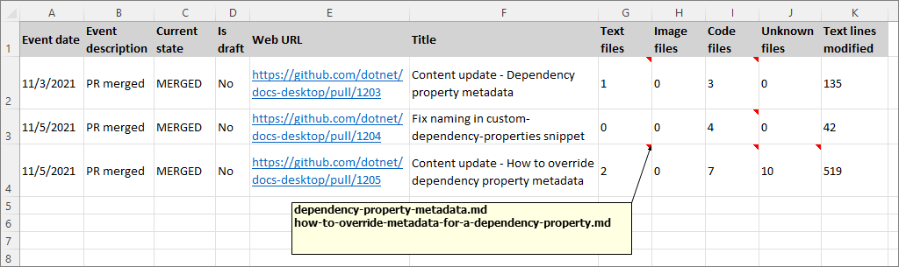
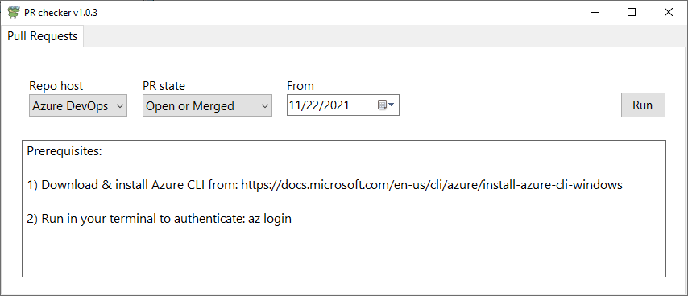

# Pull Request checker

Available (free) in the [Microsoft Store](https://www.microsoft.com/en-us/p/pull-request-checker/9n03ckqjkgh3).

## Summary

An open source toolset for tracking pull requests in GitHub and Azure DevOp.

## Features

Track your pull requests in GitHub and Azure DevOps.

## Getting started

### Tracking GitHub pull requests

Prior to first-time use:

- Download & install [GitHub CLI](https://cli.github.com/).
- Run `gh auth login --web` in your terminal to authenticate.
- Restart the app after authentication.

To get your pull requests:

1. In the **Pull requests** tab of the UI, select the **GitHub** option. Select **PR state** and **From** search options.

    

1. Choose **Run**. The app will search your GitHub PRs and open an Excel sheet with info for each PR, including file modification data.

    

### Tracking Azure DevOps pull requests

Prior to first-time use:

- Download & install [Azure CLI](https://docs.microsoft.com/cli/azure/install-azure-cli-windows).
- Run `az login` in your terminal to authenticate.
- Restart the app after authentication.

To get your pull requests:

1. In the **Pull requests** tab of the UI, select the **Azure DevOps** option. Select **PR state** and **From** search options.

    

1. Choose **Run**.

The app will search for your Azure DevOps PRs and open an Excel sheet with the results.

## Manually compile a single file executable

Although it's easier to install the app from the Microsoft Store, you can compile and install the app using Visual Studio.

### Prerequisites

- [.NET 5+](https://dotnet.microsoft.com/download)
- [Visual Studio 2019+](https://visualstudio.microsoft.com/vs/)
- Microsoft Excel

### Create an executable

1. Open the project in Visual Studio.

1. From the menu bar, choose **Build** > **Publish...**.

1. Choose the **Publish your app to a local folder** option, then select **Finish**.

1. Choose **Show all settings**.

1. Choose **Framework-dependent**, **Produce single file**, and **win-x64** in the profile settings, and note the **Target location** of the compiled executable.

1. Choose **Publish**.
